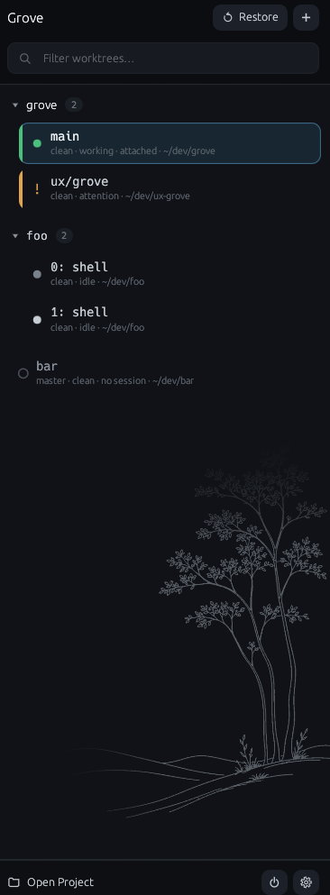

# Grove

A native GUI for Git projects, their worktrees, and the tmux session in each
one.

Grove does not render terminals. It launches your terminal attached to a
private tmux server. Closing Grove leaves every session running.



## What it does

Grove lists every worktree in one window, each with a status: **idle**,
**working**, or **attention**. Clicking a row switches your attached terminal
to that session, or launches a terminal if none is attached.

A worktree shows **attention** only when a program reports it (see
[Agents](#agents)) — Grove never guesses from process names or reads
scrollback. Once set, attention stays until you open that session.

## Requirements

- **Linux.** Wayland-first (developed on Fedora); X11 works too.
- **git** and **tmux** on `PATH`. tmux 3.5 or newer for extended-key
  handling; 3.6 adds pane scrollbars, which Grove enables when present.
- **A terminal emulator.** On first run Grove probes for `ptyxis`, `foot`,
  `alacritty`, `kitty` and `gnome-terminal`, in that order, and writes the
  first it finds into your config. Any other terminal works if you write the
  command yourself.

## Install

```bash
just install-all
```

That installs the binary into `~/.cargo/bin` and adds the launcher entry and
icon. `just install` does the binary alone; `just install-desktop` does the
launcher entry alone. Without `just`:

```bash
cargo install --path crates/grove --locked
```

Then run it:

```bash
grove
```

There is nothing to configure first. Grove writes a commented `config.toml`
on first run recording the terminal it detected.

## Getting started

1. **Open a project** with the folder entry in the footer.
   Point it at any directory inside a Git repository; Grove finds the
   repository and lists its worktrees.
2. **Press Enter on a row.** Grove creates the tmux session if needed, then
   switches your attached terminal to it or launches a new one.
3. **Create worktrees with `Ctrl+N`.** Pick a base ref and Grove runs
   `git worktree add`. The path is editable before anything happens.

Sessions outlive the GUI. Quitting Grove or closing its window does not touch
a running session. The one exception is the power button in the footer, which
kills the tmux server and asks for a second click.

## Keyboard

| Key | Does |
| --- | --- |
| `↑` `↓` | Move through the list |
| `Enter` | Open the selected worktree, or switch to it |
| `Ctrl+N` | Create a worktree |
| `Ctrl+R` | Restore: rebuild the view from git and tmux |
| `Delete` | Open the removal dialog for the selected row |
| `Alt+1`…`Alt+9` | Assign this worktree a number (see below); same key removes it |
| `Ctrl+Q` / `Ctrl+W` | Quit — sessions keep running |

The field at the top filters the list as you type.

Right-click a row for the rest: open in a new terminal, add a tmux window,
start an agent, refresh, remove.

## Automation

Grove exposes its current projects, Git worktrees, and live sessions as
versioned JSON:

```bash
grove project list
grove worktree list
grove session list
grove snapshot
```

These commands are read-only. Worktree discovery reads Git as the source of
truth, session discovery reads Grove's private tmux server, and an unavailable
repository is reported without hiding healthy projects from the response.
They query `grove serve` when it is running and retain direct read-only
collection as a fallback. `grove snapshot` returns projects, worktrees,
sessions, windows, numbered slots and known agent conversations from one state
load and one collection pass.

### Local service

Grove starts a small local service on demand:

```bash
grove serve
```

It owns the public runtime socket independently of the GUI. Agent reports that
arrive while the GUI is closed are held until the next GUI connects, and
`grove toggle` can ask the service to launch the GUI. The service never owns
terminal processes; tmux remains the persistent terminal runtime. Running
`grove serve` directly keeps it in the foreground, which is useful for service
managers and diagnostics.

## Reaching a worktree from anywhere

Grove cannot bind a desktop shortcut itself, so it provides a command to bind:

```bash
grove toggle 3     # open the session of the worktree carrying number 3
grove toggle       # start Grove, or close the running one
```

Assign a row its number with `Alt+<digit>`, then bind `grove toggle 1`…`9` to
`Super+1`…`9` in your compositor. If Grove is not running, it starts and opens
the worktree once it knows what exists.

The numbers are labels stored in Grove's state file. They name nothing in git
or tmux.

## Agents

Any program can report a session's status:

```bash
grove notify --state attention --message "needs permission to run tests"
```

Inside a Grove session `$GROVE_SESSION` is already set, so there is nothing to
pass. `attention` is sticky and clears when you open the session; `working`
and `idle` are hints the next poll confirms.

### Claude Code

Claude Code is the one agent Grove knows by name:

```bash
grove hooks install
```

That merges `grove notify --hook` into `~/.claude/settings.json` on five
events. Your own hooks are kept, the file is backed up first, a file that
cannot be parsed is reported rather than overwritten, and installing twice
leaves one entry per event. Restart Claude Code afterwards — it reads its
settings at startup. `grove hooks print` shows what would be added and changes
nothing; `grove hooks uninstall` removes it.

With hooks installed, Grove knows which tmux window an agent is talking from,
what it is waiting for, and which conversation it belongs to, so the row menu
offers *Resume agent conversation* and *Open agent transcript*. Set
`[agents] resume_command` for the first one; Grove ships no default.

## Configuration

`config.toml` is yours. Hand edits survive: the Settings pane edits it key by
key, preserving comments and formatting.

```toml
[terminal]
command = "kitty tmux -S {socket} attach-session -t {session}"

[worktrees]
default_parent = "/home/you/worktrees"

[status]
working_window_secs = 10
agent_commands = ["claude", "aider", "codex", "goose"]
bell_is_attention = false
desktop_notifications = true

[agents]
command = "claude"
resume_command = "claude --resume {agent_session}"
resource_accounting = "auto"    # auto | always | never
```

Templates are split with shell quoting rules *first*, then the placeholders
(`{socket}` `{session}` `{worktree}` `{project}` `{branch}`) are substituted
into the resulting arguments — so a path with a space, or a branch name with a
semicolon, cannot become a second command.

With `resource_accounting` on a systemd machine, each agent runs in its own
scope and its RAM and CPU show up on the row.

### tmux

Grove runs a **private tmux server** on its own socket; your everyday tmux is
untouched. Its config sources your `~/.tmux.conf` if you have one, then
Grove's managed settings, then leaves the tail of the file for your overrides,
so anything you set wins.

Grove's managed settings turn the status bar off (Grove is already that UI)
and turn on a pane scrollbar, activity monitoring, `allow-passthrough`, and
the extended-key handling that makes `Shift+Enter` reach the program in the
pane. To get the status bar back, `set -g status on` in your `tmux.conf`.

## What Grove will not do

- **Nothing is deleted because Grove lost track of it.** Git and tmux are the
  source of truth; Grove's files are only an index. A worktree missing from
  that index is marked, not removed.
- **Refreshing marks; it does not act.** Restore reconciles the view with
  reality — reattaching live sessions, flagging stopped ones, listing sessions
  with no worktree behind them. It deletes nothing.
- **The destructive operations are four separate ones**, each with its own
  confirmation: removing a project from Grove, closing a tmux session,
  removing a git worktree, and deleting a branch. Removing a project from the
  list touches no repository.
- **Before removing anything**, Grove shows what it found: uncommitted
  changes, commits on no upstream, and whether something is still running in a
  pane. Forcing past git's refusal takes a second confirmation.
- **Terminal contents are never read or logged.**

## Where things live

| | |
| --- | --- |
| `~/.config/grove/config.toml` | Yours. Grove reads it; you own it. |
| `~/.config/grove/tmux.conf` | Yours. Written once, then never again. |
| `~/.config/grove/grove.tmux.conf` | Grove's. Rewritten every start — don't edit. |
| `~/.local/state/grove/state.toml` | The index: projects, sessions, numbers. |
| `$XDG_RUNTIME_DIR/grove/` | The tmux, service, and live-GUI sockets. |

Losing `state.toml` loses nothing important. Worktree IDs are derived from the
repository and path, so Grove re-derives the same ones and reattaches to the
sessions still running.

## Building

```bash
cargo build --workspace
cargo test --workspace
cargo clippy --workspace --all-targets -- -D warnings
cargo fmt --all
```

Or `just gate` to run all of it. All four must pass.

Architecture notes are in [docs/ARCHITECTURE.md](docs/ARCHITECTURE.md); the
full product design is in [docs/DESIGN.md](docs/DESIGN.md).

## License

MIT — see [LICENSE](LICENSE).
